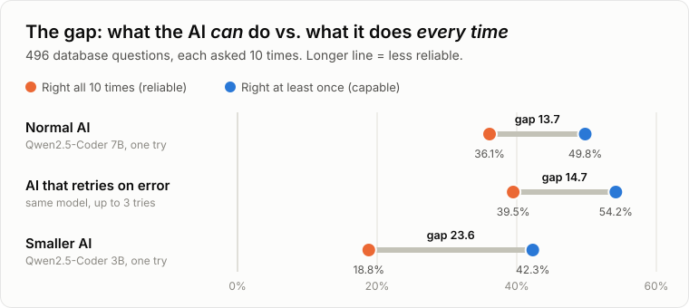
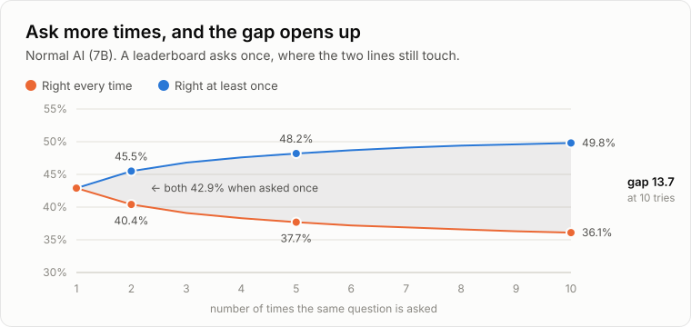
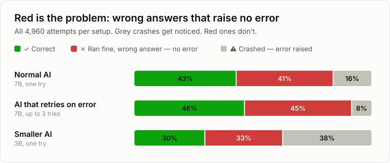

# Ask an AI the same question twice. Do you get the same right answer?

[](https://github.com/MohanVishe/nl2sql-reliability/actions/workflows/ci.yml)


[](LICENSE)

AI can turn a plain-English question — *"which customers spent the most last month?"* — into
**SQL**, the language databases understand. Leaderboards score this by asking each question
**once**. But AI has randomness built in — ask again and you can get a different answer.

So I asked every question **ten times**. Here are the ten tries on one real question (the one
explained [below](#one-character-half-the-time)):

> ✅ ✅ ✅ ❌ ❌ ✅ ❌ ✅ ❌ ❌ &nbsp; *(5 right out of 10)*

A leaderboard sees only the first try, and would score this question as solved.

<p align="center"></p>

**The blue dot is the flattering number** — a question counts as solved if the AI got it right
even once. **The orange dot is what you can actually rely on.** The line between them is questions
the AI gets right *only sometimes*: they pass your testing, then fail in production with no
warning.

---

## One try hides the problem

<p align="center"></p>

Asked once, the two lines are the same number — that is all a leaderboard can see. Each extra
try gives the AI another chance to get lucky (blue goes up) and another chance to slip (orange
goes down). **Most of the gap has opened by the third try.**

---

## One character, half the time

A real question from the test: *"What's the French name of this card?"*

The database has an English table (`T1`) and a translations table (`T2`). Across ten identical
tries, the AI wrote this five times:

```sql
SELECT T2.name ...   -- ✅ French name, correct
```

and this the other five:

```sql
SELECT T1.name ...   -- ❌ English name, wrong
```

Same prompt. One character different. **The wrong one runs perfectly** and returns a
reasonable-looking answer. Nothing crashes, nothing warns you. Ask once, like a leaderboard does,
and it's a coin flip whether this question gets scored right or wrong.

---

## The worst mistakes don't look like mistakes

<p align="center"></p>

A crash is easy — your code catches the error. **The red bars are the real problem**: the
query runs fine and the answer is wrong. For the normal AI, those silent mistakes outnumber the
crashes more than **2 to 1**.

---

## I tried the two obvious fixes. Neither closed the gap.

**🔁 Let the AI fix its own mistakes.** When a query crashed, I showed the AI the error and let it
try again, up to three times. That's what most "AI agents" do.

→ Both scores went up a little (+4.4 and +3.4 points). **But the gap didn't shrink** — it stayed
about where it was (13.7 → 14.7, a difference within noise). The retry only kicks in when
something *crashes*, so it never sees the silent mistakes. Even on the crashes it could see, it
turned only **1 in 6** into a right answer; counting every wrong answer, it fixed **1 in 20**. And
some crashes it "fixed" just became silent wrong answers instead.

**📉 Use a smaller, cheaper AI.** Same family, half the size.

→ It lost **7.5 points** on the flattering score but **17.3 points** on reliability — more than
twice as much. **The gap nearly doubled** (13.7 → 23.6). And on my machine it wasn't even
faster.

> **The flattering score makes the smaller model look a bit worse. On reliability, it's about
> half as good.**

---

## What this means if you build with AI

- **Test every question more than once.** One passing run proves very little.
- **Don't rely on error handling.** For the main model, most mistakes never raised an error.
- **Test on your own database.** The gap ranged from 0 to 31 points depending on the database.
- **Don't pick a smaller model from its benchmark score alone.** The score hides how much
  consistency you're giving up.

---

## How I tested it

**498 questions → ask the AI 10 times each → run every query on the real database → check the
rows that come back**

- **Three setups:** a 7B model, the same model with retries, and a smaller 3B model. (*7B* means
  7 billion *parameters* — the internal numbers a model learns. More parameters usually means a
  more capable, but slower and more memory-hungry, model.)
- **Free, open models** ([Qwen2.5-Coder](https://github.com/QwenLM/Qwen2.5-Coder)) running on my
  own computer. Big hosted models like GPT or Claude weren't part of this round; the same
  harness can test them.
- **14,940 AI-written queries** in total, all run locally on one desktop GPU. **Cost: $0.**
- **A cleaned-up benchmark.** The popular BIRD test set has errors in about half its answer
  key, so I used [Arcwise-Plat-SQL](https://github.com/uiuc-kang-lab/text_to_sql_benchmarks), a
  version corrected by database experts.
- **No AI grades the AI.** A query counts as correct only if it returns the right rows from the
  real database.
- **Settings:** randomness ("temperature") at a low **0.2**. It can't be 0, or all ten tries
  would come out identical and there'd be nothing to measure. Each reply can be up to 512 tokens
  (a single query needs about 50). Reasons for every setting are in
  [EXPLAINED §6](docs/EXPLAINED.md#the-settings-and-why-we-picked-them) and
  [METHOD](docs/METHOD.md#settings-and-why).

## Can you trust the numbers?

- **Every single attempt is published** in [`results/final/`](results/final/) — the AI's raw
  reply, the query, and the verdict. You can recompute every number here without running a model.
- **Two built-in math checks** confirm the scoring is right — both pass for all three setups.
- **Every change is tested for luck.** Could a difference just be chance — a few easy questions
  landing on one side? I reshuffled the questions 10,000 times and checked whether the difference
  survives. The score changes above all do; the only one that doesn't is the retry loop's tiny
  gap change, which is why it's called "within noise".
- **251 automated tests** run on every change.

---

## Read more

| If you want… | Read |
|---|---|
| The whole story, no background needed | **[docs/EXPLAINED.md](docs/EXPLAINED.md)** |
| The technical design, scoring rules and full tables | [docs/METHOD.md](docs/METHOD.md) |
| Exact settings, dates and timings for each run | [docs/RUN-LOG.md](docs/RUN-LOG.md) |
| A word you didn't recognise | [the glossary](docs/EXPLAINED.md#14-glossary) |

## Run it yourself

Needs Python 3.11+, [uv](https://docs.astral.sh/uv/) and [Ollama](https://ollama.com). Free, runs
on a normal gaming GPU.

```bash
uv venv && uv pip install -e ".[dev]"
uv run python scripts/fetch_databases.py
ollama pull qwen2.5-coder:7b
uv run python scripts/run_arm.py --arm local-7b-single --k 10
uv run python scripts/report.py
```

Full reproduction steps for all three setups are in [docs/METHOD.md](docs/METHOD.md#reproduce).

---

MIT licence for the code. The Arcwise-Plat-SQL data is CC BY-SA 4.0 and belongs to its authors;
it is downloaded when you run the project, not stored here.
